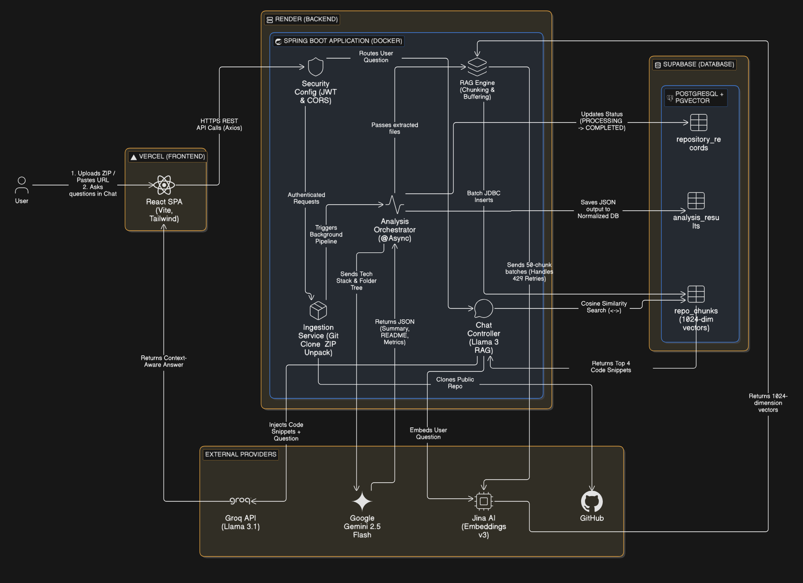

# Lantern - Repository Analyzer

*The biggest barrier to contributing to open source isn't skill, but understanding an unfamiliar codebase.*

Lantern is an intelligent repository analysis and visualization tool. By uploading a compressed project archive or providing a GitHub link, developers can instantly generate automated documentation, map folder structures, detect tech stacks, and interact with their codebase using Beacon, a RAG-enabled AI assistant.

Lantern was built to solve a simple problem: understanding a new codebase is often harder than writing code for it. Whether you're a student exploring projects, a developer onboarding onto a team, or an open-source contributor trying to find a starting point, Lantern aims to reduce the "time-to-understanding" from hours to minutes.

---

## Table of Contents

* [Project Vision](#project-vision)
* [Features](#-features)
* [Architecture & Implementation](#️-architecture--implementation)
* [System Architecture](#system-architecture)
* [Tech Stack](#️-tech-stack)
* [API Overview](#-api-overview)
* [Live API Documentation](#-live-api-documentation)
* [Design Philosophy](#-design-philosophy)
* [Security Considerations](#-security-considerations)
* [Setup & Installation](#-setup--installation)
* [Roadmap](#-roadmap)
* [Project Structure](#-project-structure)
* [Contributing](#-contributing)
* [License](#-license)

---

## Project Vision

Lantern is designed to become an **AI Tech Lead for repositories**.

Given any repository, Lantern aims to:

* Explain what the project does.
* Detect technologies and frameworks.
* Visualize architecture and folder structure.
* Generate professional documentation.
* Assist contributors during onboarding.
* Provide repository-aware Q&A through Retrieval-Augmented Generation (RAG).
* Identify technical debt and potential improvements.

Ultimately, Lantern seeks to answer a single question:

> "How can we make unfamiliar codebases immediately understandable?"

---

## Features

### Automated Codebase Analysis

Instantly parses uploaded repositories to generate comprehensive, highly accurate READMEs, executive summaries, and architectural health checks.

### Intelligent Folder Mapping

Reconstructs the exact directory structure of your project using actual file and folder names (no obfuscated UUIDs), complete with AI-annotated file purposes.

### Tech Stack Detection

Automatically scans dependencies and configuration files to identify the languages, frameworks, and tools used in the project.

### Beacon (RAG-Enabled Chat)

A built-in AI assistant that lets you "chat" directly with your repository. Beacon understands your specific logic, traces execution paths, and clarifies complex files.

### Bulletproof Ingestion

Handles repository ZIP uploads through an asynchronous analysis pipeline. Features a 500KB network upload limit and a strict 2MB uncompressed extraction limit to prevent memory bottlenecks and protect against ZIP bombs.

### Additional Capabilities

* Repository summaries
* Architecture pattern detection
* Resume bullet generation
* Interview question generation
* Technical debt detection *(planned)*
* Dependency graph visualization *(planned)*
* Good first issue suggestions *(planned)*
* Code health scoring *(planned)*

---

## Architecture & Implementation

Lantern is built on a decoupled, asynchronous architecture designed to handle computationally heavy AI workflows on constrained cloud environments without dropping requests or running out of memory.

### The Pipeline Model

The application utilizes an Event-Driven / Asynchronous Pipeline pattern for ingestion, coupled with a Retrieval-Augmented Generation (RAG) model for the chatbot.

---

### 1. Ingestion & Security Layer

When a user uploads a ZIP or provides a GitHub link, the backend immediately intercepts the payload.

The system enforces a 500KB network limit. During unzipping, a running byte-counter enforces a 2MB extraction limit; if a ZIP bomb is detected, the process aborts instantly and purges the temp files.

---

### 2. Asynchronous Master Analysis

To prevent blocking the main thread, the actual analysis runs asynchronously.

The backend recursively maps the directory structure, identifies the tech stack, and packages this telemetry into a single, highly optimized prompt.

This prompt is sent to an LLM (e.g., Gemini 2.5 Flash), which returns a strictly formatted JSON payload containing the README, architecture pattern, resume bullets, and interview questions.

---

### 3. The RAG Pipeline (Code Indexing)

Simultaneously, the codebase is aggressively chunked (e.g., 700 characters with a 150-character overlap).

These chunks are sent to an embedding model (e.g., Jina AI) to be converted into mathematical vectors (embeddings).

The vectors and the raw code chunks are stored inside a PostgreSQL database utilizing the pgvector extension.

---

### 4. Beacon (The Chatbot Implementation)

When a user asks a question, Beacon embeds the question using the same embedding model.

The backend performs a Cosine Similarity Search in the database to find the top 4 most relevant code chunks.

These raw code snippets are injected into a dynamic prompt alongside the user's question and sent to a fast inference engine (e.g., Groq / Llama-3).

Beacon responds strictly using the injected context, eliminating AI hallucinations.

---

## Architecture Diagram


---

## Tech Stack

### Frontend

* Framework: React + Vite (TypeScript)
* Routing & State: TanStack Router, TanStack Query
* Styling & UI: TailwindCSS, Radix UI, Framer Motion
* Deployment: Vercel

### Backend

* Framework: Java + Spring Boot (RESTful API, Async processing)
* Data Layer: PostgreSQL (Supabase) + pgvector, Spring Data JPA, HikariCP (Batching optimized)
* Deployment: Docker, Render

### AI Capabilities

* Analysis Engine: Google Gemini (Generates summaries, READMEs, and structure analysis)
* Embedding Engine: Jina AI (jina-embeddings-v3)
* Chat Engine (Beacon): Groq API (Llama-3)

### Repository Analysis

* JGit

### Documentation

* Swagger/OpenAPI

---

## API Overview

| Endpoint                           | Method | Description                                                                 |
|------------------------------------|--------|-----------------------------------------------------------------------------|
| `/api/v1/auth/register`            | POST   | Registers a new user and returns a JWT token.                               |
| `/api/v1/auth/login`               | POST   | Authenticates an existing user and returns a JWT token.                     |
| `/api/v1/repositories`             | GET    | Returns all repositories associated with the authenticated user.            |
| `/api/v1/repositories`             | POST   | Accepts a GitHub repository URL and initiates the analysis pipeline.        |
| `/api/v1/repositories/upload-zip`  | POST   | Uploads a ZIP archive for repository analysis.                              |
| `/api/v1/repositories/{id}`        | GET    | Retrieves repository metadata, status, and analysis results.                |
| `/api/v1/repositories/{id}`        | DELETE | Deletes a repository and its associated analysis data.                      |
| `/api/v1/repositories/{id}/chat`   | POST   | Sends a query to Beacon and returns a repository-aware response using RAG.  |

### Live API Documentation

* Swagger UI: [https://repo-analyzer.onrender.com/swagger-ui/index.html](https://lantern-vtnq.onrender.com/swagger-ui/index.html)
* OpenAPI Spec: [https://repo-analyzer.onrender.com/v3/api-docs](https://lantern-vtnq.onrender.com/v3/api-docs)

---

## Design Philosophy

### Clarity Through Structure

Code is inherently messy. Lantern is designed to immediately bring order to chaos by emphasizing clean visualizations and distinct architectural boundaries.

### Resource Efficiency

Parsing raw code can be memory-intensive. By enforcing strict file limits, utilizing an asynchronous orchestration pipeline, and configuring JVM garbage collection (`-Xmx300m`), the application guarantees high performance on free-tier cloud instances.

### Conversational Understanding

Documentation is rarely enough on its own. Integrating the Beacon RAG pipeline ensures that developers don't just see the structure—they can actively question it.

### Learn By Building

Lantern was intentionally built as a vehicle to explore:

* Java Backend Development
* Spring Boot
* Clean Architecture
* PostgreSQL & pgvector
* Retrieval-Augmented Generation (RAG)
* System Design
* Asynchronous Processing
* AI Integration at Scale

---

## Security Considerations

Lantern implements several safeguards to ensure reliability and safe repository ingestion:

* ZIP bomb detection
* Maximum upload size enforcement
* JWT-based authentication
* Temporary file cleanup
* Request validation
* Rate limiting *(planned)*
* API key isolation via environment variables
* Secure password hashing using BCrypt

---

## Setup & Installation

### Prerequisites

* Java 17 or 21
* Maven
* Node.js (v18+) & npm/yarn
* A Supabase project (with pgvector enabled)
* API Keys for Gemini, Jina, and Groq

### 1. Clone the Repository

```bash
git clone https://github.com/harshatha-exe/lantern.git
cd lantern
```

### 2. Backend Setup

Create an `application.yml` (or `.env` if loading via Spring profiles) in the backend with the following variables:

```env
DB_URL=jdbc:postgresql://db.[YOUR_SUPABASE_REF].supabase.co:5432/postgres
DB_USERNAME=postgres
DB_PASSWORD=your_supabase_password

JWT_SECRET_KEY=your_secure_random_string

GEMINI_API_KEY=your_gemini_key
GROQ_API_KEY=your_groq_key
JINA_API_KEY=your_jina_key
```

Run the backend:

```bash
cd backend
mvn spring-boot:run
```
Backend will start running  on http://localhost:8080.

### 3. Frontend Setup

Create a `.env` file in the frontend directory:

```env
VITE_API_URL=http://localhost:8081
```

Run the frontend client:

```bash
cd frontend
npm install
npm run dev
```
Frontend will start running on http://localhost:8081.
---

## Roadmap

### Phase 1

* [x] Repository upload
* [x] Tech stack detection
* [x] Repository summaries
* [x] README generation

### Phase 2

* [x] Beacon (RAG Chat)
* [x] Folder mapping
* [x] Resume bullet generation
* [x] Interview question generation

### Phase 3

* [ ] Architecture visualization
* [ ] Dependency graphs
* [ ] Technical debt heatmaps
* [ ] Code health scoring

### Phase 4

* [ ] Contributor onboarding assistant
* [ ] Good first issue generation
* [ ] Multi-repository comparison

---

## Project Structure

```text
lantern/
│
├── backend/
|   ├── src/main/java/com/harshatha/repo_analyzer
|       ├── config/
│       ├── controller/
│       ├── service/
│       ├── repository/
│       ├── entity/
│       ├── dto/
│       ├── security/
|       ├── service/
|       ├── RepoAnalyzerApplication.java
│       └── config/
│
├── frontend/
│   ├── src/
│       ├── api/
│       ├── components/
│       ├── contexts/
│       ├── layouts/
│       ├── routes/
│       └── hooks/
│
├── docs/
│   ├── requirements.md
│   ├── architecture.md
│   ├── api-design.md
│   ├── roadmap.md
│   └── devlog.md
│
└── README.md
```

---

## License

This project is licensed under the MIT License.

---

Built by **Harshatha Rithika**.

*Understanding a codebase shouldn't be harder than building one.*
